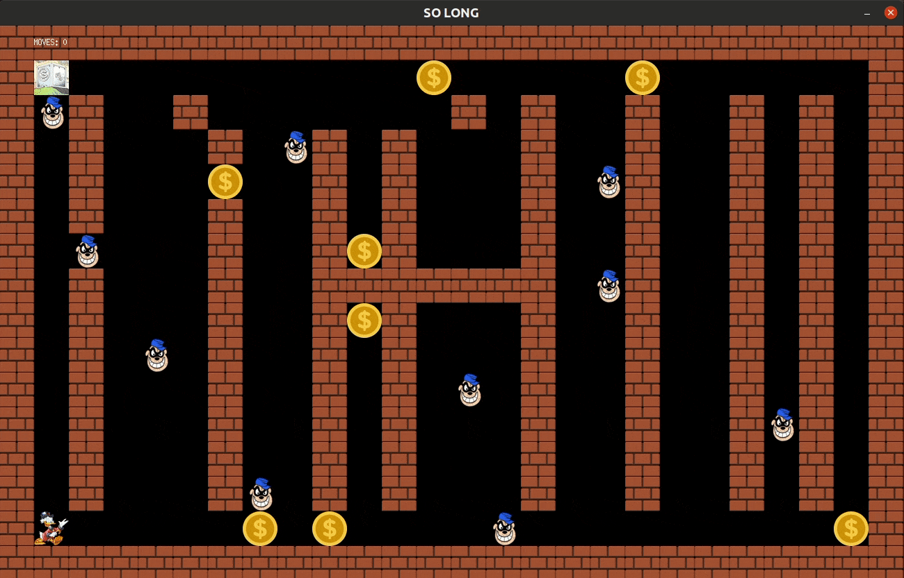

# so_long

### SUMMARY
Simple 2D game, using textures and sprites. Project of the 42 cursus. \
Uses a graphics library called MiniLibX, provided by 42 school. You can find more info on the subject file.

### COMPILATION MODES 
The program has two possible compiling modes.
 - MANDATORY: it's just the player with the collectibles. The moves counter appears on the shell.
 - <strong>BONUS (This is the most interesting one!</strong>): there's enemies patrolling the map; the player char rotates when it changes side (very basic sprite) and the moves counter appears on the game window.  
<em>Note: To run the bonus after compiling only the mandatory part you have to do make rebonus, otherwise the bonus might not work as expected.</em>

### COMPILING (with CMake)
 - go to the lib folder that corresponds to your OS \(mms is for the mac\)
 - compile the MiniLibX with 'make'
 - go back to the root folder and type: ``cmake -B build && cd build && make so_long_bonus`` \
<em>Alternatively, you could use the provided makefile,which compiles the program together with the MiniLibX. For that, just type ``make bonus``. This option is only optimized for mac though.</em>

### RUNNING
 - run ``./so_long_bonus <valid map.ber file>``
 - you can quit by pressing the red cross window button or by pressing the ESC key

### NOTES
1) If using CLion or other editor that uses CMake:
- you still have to first compile the MiniLibX lib with the Makefile
- on the Run/Debug configurations, set your working directory as ``$ProjectFileDir$``
- on the Run/Debug configurations, add ``DYLD_LIBRARY_PATH=\<working directory\>`` as an environment variable (not sure if this one is still needed)

2)  The enemy movement algorithm could be seriously improved and would benefit of a random generator, but the subject limits the usable functions.
