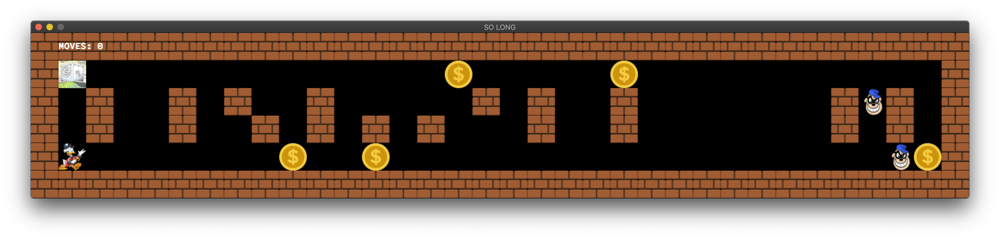

# so_long

### SUMMARY
This project consists of a very basic 2D game. It uses a (also very basic) graphics library called MiniLibX. You can find more info on the subject file.

### COMPILATION
The program has two possible compiling modes.
 - MANDATORY PART: it's just the player with the collectibles. The moves counter appears on the shell.
 - BONUS PART: there's two enemies patrolling the map; the player char rotates when it changes side (very basic sprite) and the moves counter appears on the game window.

### COMPILING (with CMake)
 - go to the lib folder that corresponds to your OS \(mms is for the mac\)
 - compile the MiniLibX with 'make'
 - go back to the root folder and type: ``cmake -B build && cd build && make so_long_bonus``

### COMPILING (with Makefile, only adapted for Mac)
 - type ``make bonus``. This will use the Makefile to compile the program along with the .dylib/.a of MiniLibX

### RUNNING
 - run ``./so_long_bonus <valid map.ber file>``
 - you can quit by pressing the red cross window button or by pressing the ESC key

### NOTES
1) To run the bonus after compiling only the mandatory part you have to do make rebonus, otherwise the bonus might not work as expected.
 
2) If using CLion or other editor that uses CMake:
- you still have to first compile the MiniLibX lib with the Makefile
- on the Run/Debug configurations, set your working directory as ``$ProjectFileDir$``
- on the Run/Debug configurations, add ``DYLD_LIBRARY_PATH=\<working directory\>`` as an environment variable (not sure if this one is still needed)

3)  The enemy movement algorithm could be seriously improved and would benefit of a random generator, but the subject limits the usable functions.
